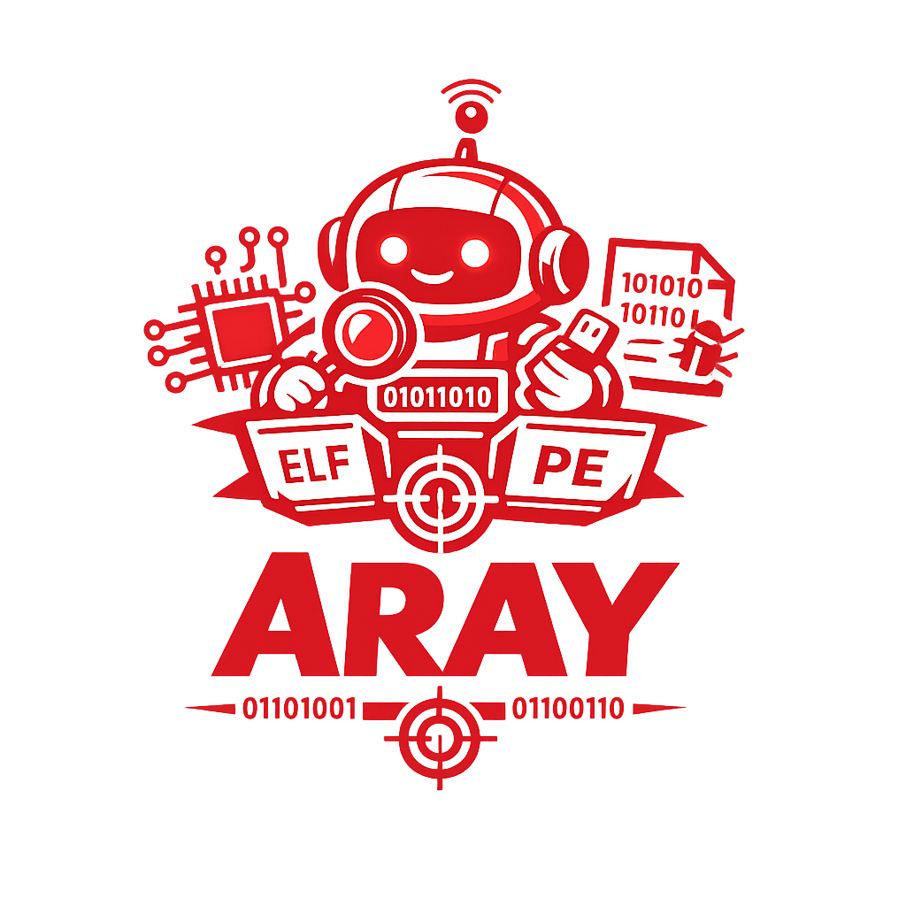
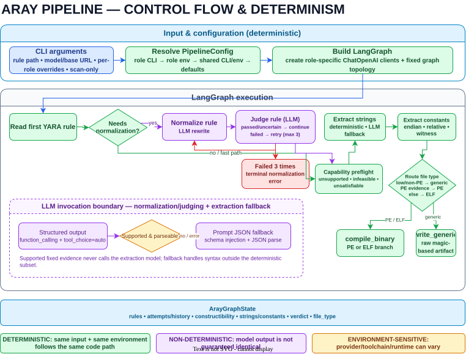
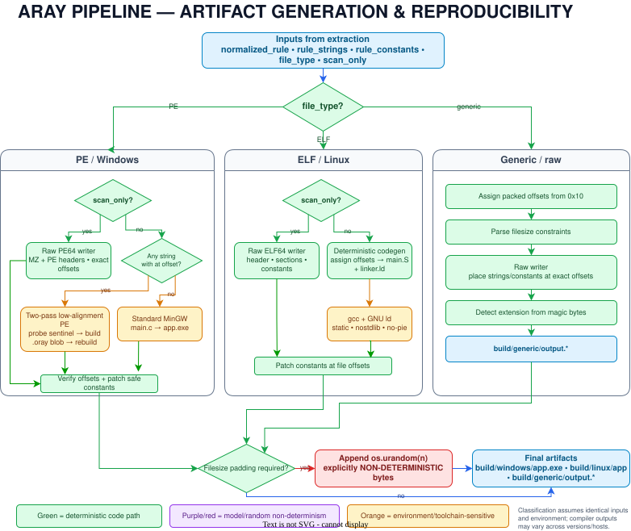

<p align="center">
  
</p>

# Aray

**Generate benign files that match YARA rules, without handling malware.**

[](https://github.com/c2dc/aray/actions/workflows/ci.yml)
[](https://codecov.io/gh/c2dc/aray)
[](https://c2dc.github.io/aray/)

Aray turns a YARA rule into a Linux ELF, Windows PE, or format-specific byte blob for detection engineering and security testing. An LLM-assisted front end interprets the rule; a conventional, deterministic backend encodes the bytes, solves file-offset constraints, builds the artifact, and exposes the generated sources for inspection.

> **The model interprets the rule. Aray's engineering backend constructs and places every resulting byte.**

```console
$ uv run aray data/rules/rule0.yar --scan-only
$ yara data/rules/rule0.yar build/linux/app
rule0 build/linux/app
```

Validated on **416 real-world rules** from the [Yara-Rules community repository](https://github.com/Yara-Rules/rules): GLM-5.2 Cloud matched **353/416 (84.9%)** through the complete pipeline and full-compile backends, compared with **330/416 (79.3%)** for GPT-4.1 in the same build mode. GPT-4.1 matched **344/416 (82.7%)** in scan-only mode, while the fully local phi4:14b configuration matched **294/416 (70.7%)**. A separate fully local experiment with the smaller Qwen3.5:9b model synthesized and validated **137/416 artifacts (32.9%)** using the full-compile backends. In normalization-only runs, GLM-5.2 accepted **412/416 (99.0%)**, compared with **404/416 (97.1%)** for GPT-4.1.

> [!WARNING]
> Aray is a research prototype under active development. APIs, CLI flags, supported YARA constructs, and artifact formats may change.

## Motivation

Security teams need realistic files to test detection and response workflows, but using live malware makes these exercises risky and expensive. Real samples require isolated infrastructure, strict handling procedures, and specialist oversight. These requirements make Disaster Recovery simulations and end-to-end security-control testing difficult to automate and repeat.

Aray generates benign artifacts that satisfy the static conditions expressed by YARA rules without reproducing the malicious behavior of the samples those rules describe. Teams can use these artifacts to exercise scanners, alert pipelines, incident-response automation, and recovery procedures in a controlled environment. The generated sources and deterministic construction stages also make each artifact inspectable; see [Architecture](docs/site/architecture.md) for the trust boundary and backend design.

The same workflow provides a testbed for YARA rule normalization and autonomous cyber-defense research. Researchers can study how complex detection logic is reduced to supported constraints, how those constraints are encoded into executable formats, and how automated defenses behave when presented with controlled bursts of benign detections. Such experiments can measure alert deduplication, queue saturation, response latency, and resilience to false-positive bursts without introducing live malware. See [Evaluation](docs/site/evaluation.md) for the current corpus, methodology, and end-to-end results.

## Quick Start

The shortest path uses scan-only mode. It writes a minimal scanner artifact directly, so GCC and MinGW are not required.

**Requirements:** Linux, Python 3.12+, [`uv`](https://docs.astral.sh/uv/), the `yara` CLI, and access to an OpenAI-compatible model.

```bash
git clone https://github.com/c2dc/aray.git
cd aray
uv sync

cp .env_example .env
# Edit .env and set OPENAI_API_KEY

uv run aray data/rules/rule0.yar --scan-only
yara data/rules/rule0.yar build/linux/app
```

A successful scan prints:

```text
rule0 build/linux/app
```

The generated `build/linux/app` is benign and contains the byte patterns needed to satisfy the rule.

### Run Fully Locally

With [Ollama](https://ollama.com) and `phi4:14b`, the rule never leaves the machine:

```bash
ollama pull phi4:14b

uv run aray data/rules/rule0.yar \
  --model phi4:14b \
  --base-url http://localhost:11434/v1 \
  --no-stream \
  --scan-only

yara data/rules/rule0.yar build/linux/app
```

No API key is needed for a keyless local gateway. Aray supplies the placeholder required by the OpenAI client library.

### Build a Runnable Executable

Remove `--scan-only` to use the executable backend:

```bash
sudo apt install gcc binutils

uv run aray data/rules/rule0.yar
./build/linux/app
yara data/rules/rule0.yar build/linux/app
```

Windows PE generation additionally requires `x86_64-w64-mingw32-gcc`:

```bash
sudo apt install gcc-mingw-w64-x86-64
uv run aray data/rules/rule6.yar
yara data/rules/rule6.yar build/windows/app.exe
```

## Common Tasks

| I want to... | Command |
|---|---|
| Generate a scanner artifact without a compiler | `uv run aray rule.yar --scan-only` |
| Generate a runnable ELF or PE | `uv run aray rule.yar` |
| Verify the output | `yara rule.yar build/linux/app` |
| Trace routing and byte placement | `uv run aray rule.yar --debug` |
| Evaluate a directory of rules | `uv run aray-eval rules/ --scan-only` |
| Normalize a rule collection | `uv run aray-normalize rules/` |
| Save the LangGraph visualization | `uv run aray rule.yar --graph` |

See [Configuration](docs/site/configuration.md) for model selection, gateways, environment variables, mixed providers, and all CLI options.

## How It Works

Aray separates probabilistic interpretation from deterministic artifact construction.

<p align="center">
  
</p>

1. **Read and classify the rule deterministically.** Aray extracts the first non-private rule and checks whether unsupported complex constructs require normalization.
2. **Interpret the rule with constrained LLM calls.** Only rules containing features such as regex strings, hex wildcards or jumps, `or`, or numeric `N of` expressions enter the normalization-and-judge loop. All rules then use structured extraction for strings and integer constants.
3. **Validate the representation.** Pydantic models constrain the response shape. Routing cross-checks critical offset-zero claims against the rule text rather than blindly trusting extracted data.
4. **Construct the artifact deterministically.** Python code assigns offsets, encodes ASCII/hex/wide strings, routes the target format, generates source or binary structures, patches constants, and applies file-size constraints.
5. **Verify independently.** `aray-eval` invokes the real YARA CLI against each generated artifact and records the result. For a single run, use the `yara` command shown in the Quick Start.

LangGraph orchestrates these stages; it does not generate the binaries. The binary construction logic lives in `aray/codegen.py`, `aray/compiler.py`, and `aray/artifact_writer.py`.

## Deterministic Engineering

The backend operates on typed string and constant entries. It does not ask the model to produce C, assembly, linker scripts, PE headers, or arbitrary binary data.

### Exact Layout

- **Linux ELF:** each string is emitted into a dedicated GNU assembler section. A generated linker script uses `PT_LOAD FILEHDR PHDRS` and a fixed image base so YARA file offsets map to known virtual addresses. Non-nested `uint16` and `uint32` constants are patched as little-endian bytes at explicit file offsets.
- **Windows PE:** ordinary PE rules are compiled with MinGW and naturally satisfy the MZ and PE-signature checks. Rules with `$string at offset` use a low-alignment PE and a two-pass `.oray` section build; Aray probes the section start, computes padding, rebuilds, and verifies every requested placement byte for byte.
- **Generic formats:** PHP, ASP, ZIP, Office, PNG, JPEG, GIF, and other non-PE magic anchored at offset zero are emitted as plain byte blobs, without an ELF or PE wrapper.

### Compiler-Free Writers

`--scan-only` bypasses GCC and MinGW. Aray writes minimal ELF64 or PE64 structures directly and places rule-driven bytes at their assigned file offsets. These files are intended for scanning; they are not substitutes for the runnable artifacts produced by the compiler backends.

<p align="center">
  
</p>

### Auditable Output

The build directory contains the normalized rule and generated intermediates:

| Target | Output | Inspectable intermediates |
|---|---|---|
| Linux ELF | `build/linux/app` | `normalized_rule.yar`, `main.S`, `linker.ld` |
| Windows PE | `build/windows/app.exe` | `normalized_rule.yar`, `main.c` or `main.S` |
| Generic blob | `build/generic/output{ext}` | `normalized_rule.yar` |

The layout algorithm is deterministic for a given typed representation. Byte-for-byte reproducibility is not promised when external toolchains vary or when a `filesize` condition requires random padding.

Read [Architecture](docs/site/architecture.md) for the layout contracts, routing rules, constant encoding, retry behavior, and backend limitations.

## Where the LLM Is Used

Aray keeps the nondeterministic boundary narrow and explicit:

- **Normalization:** complex YARA constructs are simplified into a constructible subset supported by the backends. For `or` conditions, YARA precedence is preserved and complete branches are ranked by feasibility, filesize/padding cost, offset and format constraints, and required evidence. A deterministic pre-check skips this phase for already-supported rules. In the 416-rule evaluation, 179 rules (43%) skipped normalization, though they still used structured extraction.
- **Judging:** retained regex replacements are first tested against the original pattern with `yara-python`; a model then verifies subset correctness and rejects clearly more expensive branches when a cheaper constructible alternative exists. A failed verdict retries normalization up to three times; three failures stop the pipeline before extraction or construction. An `uncertain` verdict currently proceeds.
- **Structured extraction:** the model returns strings, formats, offsets, and integer checks through Pydantic schemas. Structured output is attempted first, with a validated prompt-based JSON fallback for models without tool-call support.

Schema validation guarantees structure, not semantic correctness. Extraction mistakes remain possible, which is why corpus evaluation uses the YARA engine as an external oracle. Different models can be assigned to normalization and extraction, including local OpenAI-compatible models.

## Supported Artifacts

| Capability | ELF | PE | Generic |
|---|:---:|:---:|:---:|
| ASCII strings | Yes | Yes | Yes |
| Hex byte patterns | Yes | Yes | Yes |
| YARA `wide` strings | Routes to PE | Yes | No |
| Multiple `at` constraints | Yes | Yes | Yes |
| `uint16` / `uint32` constants | Yes | Limited in runnable PE | Yes |
| Nested PE-signature check | N/A | Native | N/A |
| Compiler-free `--scan-only` | Yes | Yes | Always compiler-free |
| Runnable output | Yes | Yes | Format-dependent blob |

Filesize comparisons using `>`, `>=`, `<`, `<=`, or `==`, with optional `KB`, `MB`, or `GB` suffixes, are parsed and applied after construction. An artifact that is already larger than a maximum cannot be shrunk; Aray emits a warning in that case.

See the [sample rule catalog](data/rules/CATALOG.md) for focused examples of each supported path.

## Evaluation

Aray was evaluated on 416 public rules from [Yara-Rules/rules](https://github.com/Yara-Rules/rules), covering CVEs, exploit kits, malware families, packers, webshells, email, and cryptography rules.

Full-compile results, including compiler and runnable-backend constraints:

| Model | Matches | Success rate |
|---|---:|---:|
| GPT-4.1 | 330 / 416 | **79.3%** |
| GLM-5.2 Cloud | 353 / 416 | **84.9%** |

Scan-only results, using compiler-free scanner artifacts:

| Model | Matches | Success rate |
|---|---:|---:|
| GPT-4.1 | 344 / 416 | **82.7%** |
| phi4:14b via local Ollama | 294 / 416 | **70.7%** |

### Fully Local Small-Model Experiment

[`qwen3.5:9b`](https://ollama.com/library/qwen3.5) was evaluated separately as a smaller, fully local model. It synthesized full-compile artifacts for the stored normalized corpus, and 137 of 416 artifacts produced a positive YARA match.

| Local model | Build mode | Matches | Success rate |
|---|---|---:|---:|
| Qwen3.5:9b via Ollama | Full compile | 137 / 416 | **32.9%** |

This result establishes a local baseline rather than a direct comparison with phi4:14b, which was evaluated in scan-only mode. The dominant Qwen failure modes were empty model responses and artifacts that built but did not match YARA. These results motivate response retries, stronger post-extraction validation, YARA-guided synthesis feedback, and a future Qwen scan-only run under the same protocol as phi4:14b.

The GLM-5.2 full-compile run processed the original rules through the complete pipeline with `glm-5.2:cloud` assigned to normalization, judging, and extraction. The scan-only and Qwen experiments reused the stored GPT-4.1-normalized corpus. Build modes are reported separately because scan-only avoids compiler behavior and does not promise runnable artifacts.

The normalization-only comparison used GPT-4.1 and [`glm-5.2:cloud`](https://ollama.com/library/glm-5.2) over the same original corpus:

| Normalization model | Deterministic fast path | Accepted after model call | Failed | Total accepted |
|---|---:|---:|---:|---:|
| GPT-4.1 | 179 | 225 / 237 (94.9%) | 12 | 404 / 416 (97.1%) |
| GLM-5.2 Cloud | 179 | 233 / 237 (98.3%) | 4 | 412 / 416 (99.0%) |

For GLM-5.2, Aray connected to the locally running Ollama client, while inference ran in Ollama Cloud. GPT-4.1 inference was also cloud-hosted, so this is not a local-versus-cloud comparison. Each model judged its own normalized outputs; these figures are self-judged acceptance rates rather than independent semantic validation.

The synthesis figures measure end-to-end YARA matches, not just valid model responses. See [Evaluation](docs/site/evaluation.md) for the collection breakdown, methodology, batch commands, and normalization evaluator.

## Tests

The deterministic suite makes no real LLM calls. Models are mocked while unit and integration tests exercise byte encoding, routing, offset assignment, linker generation, constant patching, direct artifact writing, retry behavior, compilation, execution, and YARA scanning.

```bash
# Unit and integration tests, always excluding real LLM calls
uv run pytest -m "not llm" tests/ -v

# Real-model end-to-end tests
uv run pytest -m llm -v
```

ELF integration tests require GCC and YARA. PE integration tests require MinGW and YARA; execution under Wine is optional.

## Limitations

- Aray implements a useful subset of YARA rather than the full language. Complex constructs are normalized and may lose semantics.
- LLM normalization and extraction can be wrong even when their responses satisfy the schema.
- The normal `aray` command constructs an artifact but does not automatically run YARA; verify manually or use `aray-eval`.
- Runnable PE strings cannot be placed inside the PE header/code region, typically below about `0x400`; use `--scan-only` for such offsets.
- `uint32(uint32(...))` is treated as a PE indicator and may misroute an unusual non-PE rule.
- A file already larger than a rule's maximum `filesize` constraint cannot be reduced.
- Rulesets currently process only the first non-private rule.

## Documentation

- [Project website](https://c2dc.github.io/aray/)
- [Architecture and deterministic backends](docs/site/architecture.md)
- [Configuration and model providers](docs/site/configuration.md)
- [Evaluation and batch tools](docs/site/evaluation.md)
- [Sample rule catalog](data/rules/CATALOG.md)

Build and preview the documentation locally:

```bash
uv sync --group docs
uv run mkdocs serve
```

## Project Layout

```text
aray/
  cli.py              CLI and configuration resolution
  graph.py            Pipeline orchestration
  nodes.py            Rule reading, interpretation, and routing
  codegen.py          Assembly, linker, and PE source generation
  compiler.py         Runnable ELF/PE backends and patching
  artifact_writer.py  Direct ELF64/PE64/generic writers
  evaluator.py        Batch construction and YARA verification
  normalizer.py       Batch normalization and judging
data/rules/           Focused example rules
evaluation/           Public rule corpus
tests/                Unit, integration, and end-to-end tests
```

## Project Affiliation and Research Team

Aray is a project of the **Lab-C2DC - Laboratory of Command and Control and Cyber-security** at the [Aeronautics Institute of Technology (ITA)](https://www.ita.br). The project is part of a research collaboration among ITA, the University of São Paulo (USP), iFood, and Texas A&M University (TAMU).

Aray was conceived and originally developed by **Emanuel Valente**.

The researchers involved in the project are:

- **Prof. Lourenço Alves Pereira Júnior** - ITA
- **Prof. Marcus Botacin** - Texas A&M University
- **Emanuel Valente** - PhD student at USP | Principal Cybersecurity Engineer at iFood.
- **Leonardo Chahud** - PhD student at ITA
