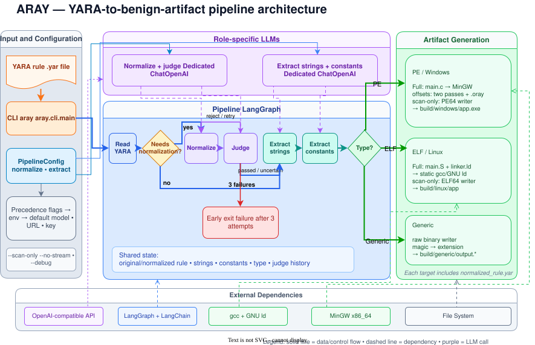

# Architecture

Aray is an LLM-assisted rule interpreter connected to deterministic binary-construction backends. This distinction is the central design constraint: model calls reduce a YARA rule to typed data, while conventional code owns byte encoding, layout, compilation, patching, and artifact writing.

<p align="center" markdown>
{ width="900" }
</p>

## Pipeline Boundary

```text
YARA rule
   |
   v
deterministic read + normalization check
   |
   +-- supported subset --------------------------+
   |                                               |
   +-- complex rule -> normalize -> judge --------+  LLM-assisted
                                                   |
                                                   v
                                  extract strings + constants  LLM-assisted
                                                   |
                                                   v
                                typed Pydantic representation
                                                   |
                                                   v
                                    validate + route format
                                                   |
                          +------------------------+------------------------+
                          |                        |                        |
                          v                        v                        v
                     ELF backend              PE backend             generic writer
                          |                        |                        |
                          +------------------------+------------------------+
                                                   |
                                                   v
                                              artifact
                                                   |
                                                   v
                                      optional external YARA scan
```

LangGraph provides orchestration, state transitions, and bounded retries. It does not generate source code or binary bytes.

## Pipeline Stages

### Read Rule

`read_yara_rule` loads the requested file. For a ruleset, it uses brace-aware parsing to select the first non-private rule; private and subsequent rules are ignored.

### Decide Whether to Normalize

`check_normalization_needed` is a deterministic regex-based check. It sends a rule through normalization when it finds:

- regex strings;
- hex wildcards (`??`);
- hex jumps (`[N]` or `[N-M]`);
- `or` conditions;
- numeric count expressions such as `5 of ($a*)`.

Otherwise the original text becomes `normalized_rule` unchanged. This skips normalization and judging, but extraction still uses a model.

### Normalize and Judge

`normalize_rule` asks the normalization model to produce a simpler rule in the supported subset. `judge_rule` compares that result with the original.

- `passed`: continue to extraction.
- `uncertain`: currently continue to extraction.
- `failed`: retry normalization with feedback.
- Three failed attempts: run `fail_normalization` and terminate without constructing an artifact.

The batch normalizer behaves differently: it treats `uncertain` as a failed quality result while retaining the normalized output for inspection or training data.

### Extract Typed Data

`extract_strings` returns entries containing a value, format, and optional file offset. `extract_constants` returns integer comparisons containing a value, offset, width, and nested-expression flag. These responses are validated by Pydantic models.

Structured output is attempted first. If a model or gateway cannot use tool calls, `aray.llm._invoke_llm` injects the JSON schema into the prompt, parses the response, and validates the same Pydantic model.

This constrains response shape, not meaning. A model can still omit a pattern or assign a wrong offset.

### Route the Artifact

`route_file_type` is pure computation. It chooses:

- `pe` for MZ/PE structural checks or wide strings;
- `generic` for non-PE magic anchored at offset zero;
- `elf` for everything else.

Critical offset-zero claims are cross-checked against the YARA text before they influence routing. This prevents a hallucinated extraction offset from turning an ELF rule into a generic blob.

## Internal Representation

The model-facing boundary uses the Pydantic types in `aray/models.py`:

- `NormalizedYaraRule`;
- `YaraStringEntry` and `YaraStrings`;
- `YaraConstantEntry` and `YaraConstants`;
- `JudgeVerdict`.

Downstream code accepts these typed entries and converts them to byte ranges. The model never emits C, assembly, linker scripts, PE headers, or complete binary data.

## Byte Encoding

`aray/codegen.py` converts each string entry into bytes:

- ASCII strings become their byte representation;
- hex patterns become parsed byte sequences;
- `wide` strings become UTF-16LE-compatible data on the PE path;
- unconstrained strings receive deterministic default offsets;
- constrained strings retain their `at` offsets.

Non-nested constants are encoded little-endian:

| YARA condition | Encoding |
|---|---|
| `uint16(N) == V` | two little-endian bytes of `V` at file offset `N` |
| `uint32(N) == V` | four little-endian bytes of `V` at file offset `N` |
| `uint32(uint32(0x3C)) == 0x00004550` | use the native PE `e_lfanew` pointer and signature |

## Linux ELF Backend

### Runnable Mode

The runnable path avoids C and libc:

1. `_assign_offsets` resolves a file offset for every string.
2. `_generate_asm_source` emits one `.section .sec_0xNNN,"aw",@progbits` block per byte range.
3. `_generate_linker_script` places each section at `ELF_BASE + file_offset`.
4. The linker script declares `PHDRS { load PT_LOAD FILEHDR PHDRS; }`, making the first load segment start at file offset zero.
5. Therefore, for these sections, `file_offset = VMA - ELF_BASE`.
6. GCC links with `-static -nostdlib -no-pie`; `_start` uses raw x86-64 Linux syscalls to print a banner and exit.
7. Supported integer constants are patched at their exact file offsets after linking.

The output is `build/linux/app`. Generated `main.S` and `linker.ld` make the placement contract inspectable.

### Scan-Only Mode

`write_linux_artifact` creates a minimal ELF64 header and a zeroed buffer, then writes strings and supported constants directly at their offsets. The header has no program or section headers, so the result is intended for scanners rather than execution.

No compiler, assembler, linker, or libc is involved.

## Windows PE Backend

### Ordinary Runnable PE

Rules without string offset constraints use MinGW. Strings become C globals and wide strings become `wchar_t` globals. The resulting executable naturally contains:

- `MZ` at file offset zero;
- `e_lfanew` at `0x3C`;
- `PE\0\0` at the location referenced by `e_lfanew`.

This satisfies standard PE YARA checks without modifying structural header bytes.

### Offset-Aware Runnable PE

A normal linker can move globals, so `$s at 0xNNN` requires a stronger layout contract. Aray builds a low-alignment PE using:

```text
-nostdlib -lkernel32 -e _start
--file-alignment=0x10
--section-alignment=0x10
```

Equal file and section alignment causes a flat mapping where file offsets correspond to RVAs. Construction uses two passes:

1. Compile a `.oray` section containing an eight-byte sentinel.
2. Find the sentinel's file offset to discover where MinGW placed section data.
3. Build a blob padded relative to that discovered start.
4. Recompile with the final blob.
5. Read the executable and verify every constrained byte range.

The freestanding `_start` uses `GetStdHandle`, `WriteFile`, and `ExitProcess`, allowing the result to run under Wine without a C runtime.

Runnable PE data cannot generally occupy offsets inside headers or code, typically below approximately `0x400`. Non-structural constants in that region are skipped with a warning. Use scan-only mode when scanner satisfaction matters more than execution.

### Scan-Only PE

`write_pe_artifact` directly writes:

- a DOS header with `MZ` and `e_lfanew`;
- a PE signature;
- an AMD64 COFF header with zero sections;
- a minimal PE32+ optional header;
- strings at their assigned offsets.

The artifact is a scanner-oriented PE64 structure, not a runnable replacement for the MinGW output. The current pipeline passes no extracted constants to this writer; its generated structure itself satisfies MZ and nested PE-signature checks.

## Generic Writer

Non-PE magic at offset zero routes to `write_generic`. It writes a plain buffer without adding executable headers:

- rule-owned magic remains at offset zero;
- other strings are packed from offset `0x10` unless constrained;
- supported constants are patched little-endian;
- an extension is selected from known magic bytes.

Known extensions include `.php`, `.asp`, `.zip`, `.png`, `.jpg`, `.gif`, and `.doc`. Unknown magic produces an extensionless `output` file.

## Filesize Constraints

The backend parses `filesize` comparisons using `>`, `>=`, `<`, `<=`, and `==`, with optional `KB`, `MB`, or `GB` units. Multiple comparisons are combined into minimum and maximum bounds.

When an artifact is too small, Aray computes a valid target size and appends random bytes. If it already meets or exceeds an exclusive upper bound, it cannot be shrunk and a warning is printed.

The amount of required padding is deterministic for the current size and bounds; padding contents use `os.urandom`. Consequently, a padded artifact is not byte-for-byte reproducible.

## Construction Checks and External Verification

Internal checks include:

- Pydantic validation of LLM response structure;
- deterministic cross-validation of format-routing evidence;
- byte-for-byte verification of offset-aware PE strings;
- subprocess failure propagation through `check=True`;
- bounds and collision checks in layout helpers.

The normal `aray` CLI does not run YARA after construction. This preserves separation between construction and acceptance testing. Use the YARA CLI manually or `aray-eval`, which treats an actual YARA match as the end-to-end success criterion.

## Source Map

| Module | Responsibility |
|---|---|
| `aray/graph.py` | orchestration and retry edges |
| `aray/nodes.py` | rule loading, model-assisted stages, routing, generic dispatch |
| `aray/models.py` | typed model boundary |
| `aray/llm.py` | structured invocation and JSON fallback |
| `aray/codegen.py` | encoding, offsets, assembly, linker scripts, PE source |
| `aray/compiler.py` | ELF/PE toolchain backends, patching, placement checks |
| `aray/artifact_writer.py` | direct ELF64, PE64, and generic writers |
| `aray/evaluator.py` | batch construction and independent YARA verification |

## Known Limitations

- Only a subset of YARA is represented by the extraction schema and backends.
- Normalization may alter semantics, and judge acceptance is model-dependent.
- An `uncertain` pipeline judge verdict proceeds to extraction.
- Nested `uint32` expressions are assumed to indicate PE structure.
- Full-compile output can vary with GCC, Binutils, or MinGW versions.
- Random filesize padding prevents byte-for-byte reproducibility.
- Rulesets process only the first non-private rule.
