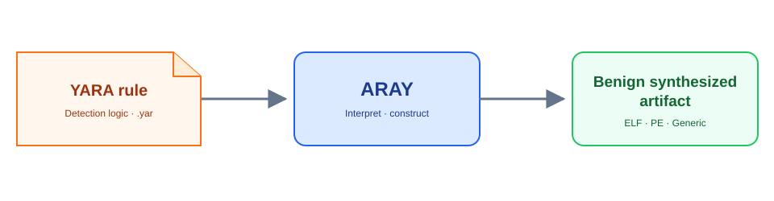

<section class="aray-hero">
  <div class="aray-hero__copy">
    <p class="aray-kicker">Detection engineering without live malware</p>
    <h1>Generate benign files that match YARA rules.</h1>
    <p class="aray-lead">Aray interprets detection logic with an LLM, then uses deterministic engineering backends to construct inspectable Linux ELF, Windows PE, and format-specific artifacts.</p>
    <a class="aray-recognition" href="https://blackhat.com/us-26/arsenal/schedule/#aray-benign-binary-synthesis-for-signature-validation-without-the-malware-52919" aria-label="Aray was selected for presentation at Black Hat USA 2026 Arsenal">
      <span>Black Hat USA 2026</span>
      <strong>Selected for Arsenal</strong>
    </a>
    <div class="aray-actions">
      <a class="md-button md-button--primary" href="#quick-start">Get started</a>
      <a class="md-button" href="architecture/">Explore the architecture</a>
    </div>
  </div>
  <div class="aray-hero__visual">
    
  </div>
</section>

<p align="center">
  
</p>

<div class="aray-metrics" markdown>

<div class="aray-metric" markdown>

<strong>416</strong>

Real-world rules evaluated

</div>

<div class="aray-metric" markdown>

<strong>84.9%</strong>

Best full-compile match rate

</div>

<div class="aray-metric" markdown>

<strong>82.7%</strong>

GPT-4.1 scan-only match rate

</div>

<div class="aray-metric" markdown>

<strong>3</strong>

Artifact families: ELF, PE, generic

</div>

</div>

## Why Aray

Testing security controls with live malware creates avoidable risk, operational overhead, and handling requirements. Aray generates non-malicious artifacts that satisfy static YARA conditions without reproducing the malicious behavior of the samples those rules describe.

Use the artifacts to exercise:

- scanner and alert pipelines;
- incident-response and recovery automation;
- detection-rule validation;
- controlled false-positive and alert-volume experiments;
- research into YARA normalization and autonomous cyber defense.

!!! warning "Research prototype"
    Aray implements a useful subset of YARA and uses probabilistic models for rule interpretation. Always verify generated output with YARA and use it only in authorized testing environments.

## A Narrow Trust Boundary

<div class="aray-boundary" markdown>

<div markdown>

### The model interprets

Complex rules may be normalized and judged by an LLM. Strings, formats, offsets, and integer checks are extracted into Pydantic models.

</div>

<div markdown>

### Conventional code constructs

Python, assemblers, linkers, and direct binary writers own byte encoding, offset placement, header construction, constant patching, and filesize constraints.

</div>

<div markdown>

### YARA verifies

The batch evaluator invokes the real YARA CLI. A valid model response or a successful build does not count as success unless the resulting artifact matches.

</div>

</div>


[Read the architecture details](architecture.md){ .md-button }

## Quick Start

The shortest path uses scan-only mode. It writes a minimal scanner artifact directly, without GCC or MinGW.

```console
$ git clone https://github.com/c2dc/aray.git
$ cd aray
$ uv sync
$ cp .env_example .env
$ uv run aray data/rules/rule0.yar --scan-only
$ yara data/rules/rule0.yar build/linux/app
rule0 build/linux/app
```

Requirements are Linux, Python 3.12+, [`uv`](https://docs.astral.sh/uv/), the YARA CLI, and access to an OpenAI-compatible model. Aray also supports fully local model execution through Ollama.

[Configure models and providers](configuration.md){ .md-button .md-button--primary }
[Browse focused examples](examples.md){ .md-button }

## Deterministic Backends

| Target | Construction strategy | Output |
|---|---|---|
| Linux ELF | GNU assembler sections and a linker script, or a direct minimal ELF64 writer | `build/linux/app` |
| Windows PE | MinGW with offset-aware two-pass placement, or a direct minimal PE64 writer | `build/windows/app.exe` |
| Generic | Direct byte-blob writer preserving format magic at offset zero | `build/generic/output{ext}` |

Generated sources and normalized rules remain available in the build directory for inspection. The model never emits C, assembly, linker scripts, PE headers, or complete binary data.

## Published Evaluation

Aray was evaluated against 416 public rules from the Yara-Rules community repository. End-to-end success means the generated artifact produced an actual match when scanned by the YARA CLI.

| Model | Build mode | Matches | Success rate |
|---|---|---:|---:|
| GLM-5.2 Cloud | Full compile | 353 / 416 | **84.9%** |
| GPT-4.1 | Scan only | 344 / 416 | **82.7%** |
| GPT-4.1 | Full compile | 330 / 416 | **79.3%** |
| phi4:14b via local Ollama | Scan only | 294 / 416 | **70.7%** |
| Qwen3.5:9b via local Ollama | Full compile | 137 / 416 | **32.9%** |

Build modes and provider conditions differ, so results are reported separately rather than treated as a controlled model leaderboard.

[Review the methodology and collection breakdown](evaluation.md){ .md-button }

## Research Team

Aray is a project of **Lab-C2DC - Laboratory of Command and Control and Cyber-security** at the [Aeronautics Institute of Technology (ITA)](https://www.ita.br). It is part of a research collaboration among ITA, the University of Sao Paulo (USP), iFood, and Texas A&M University (TAMU).

[View the source on GitHub](https://github.com/c2dc/aray){ .md-button .md-button--primary }
